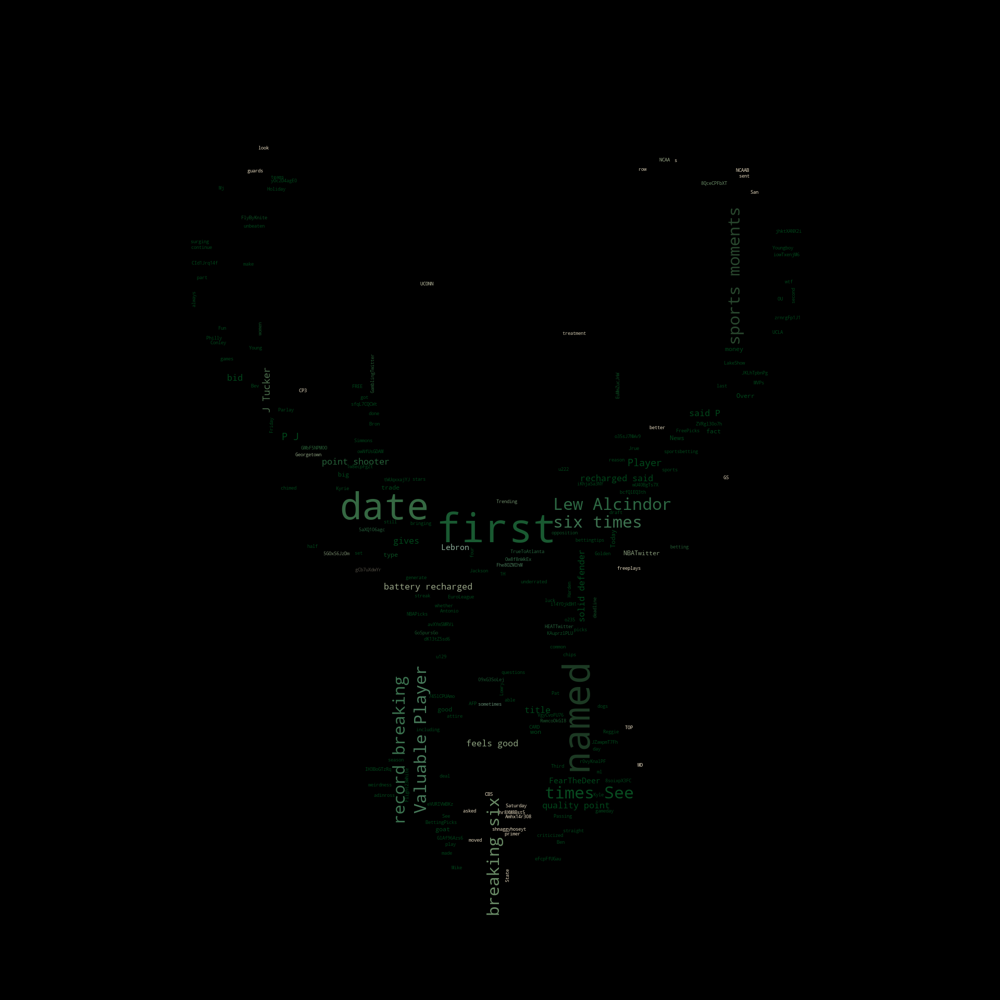
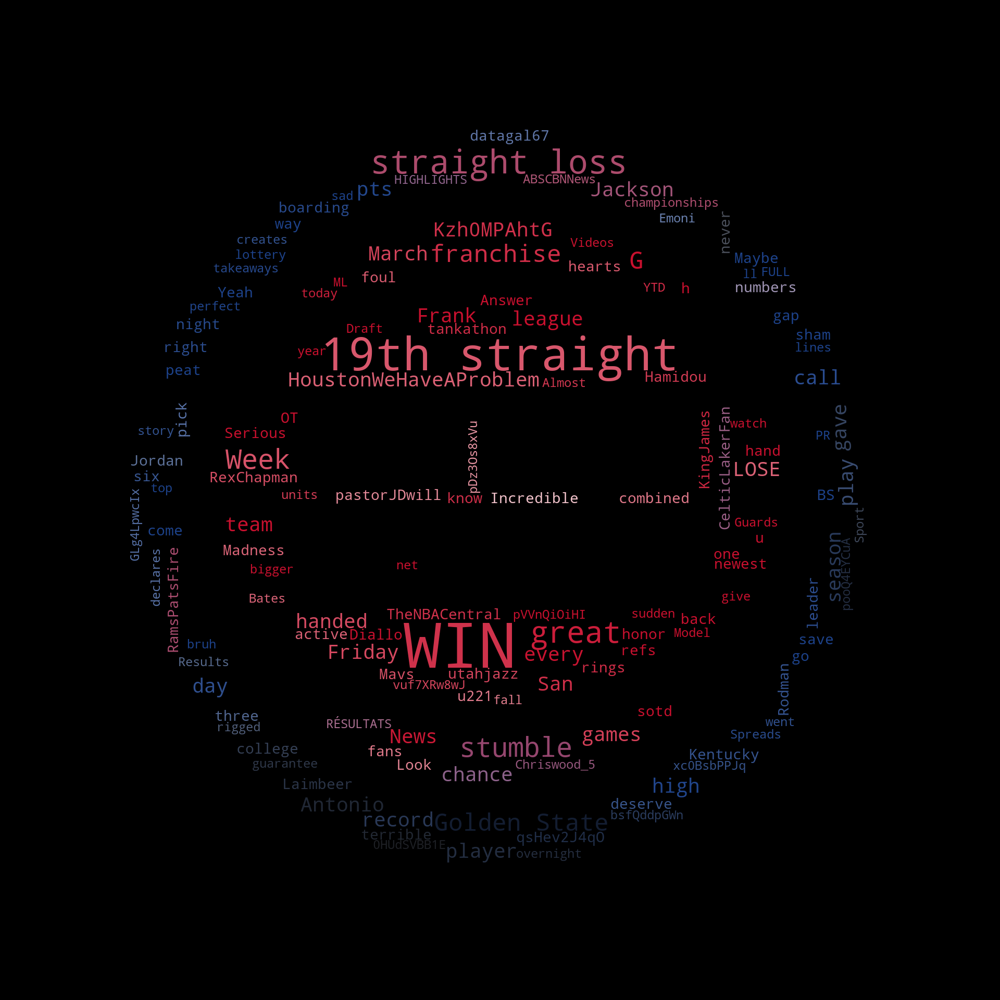
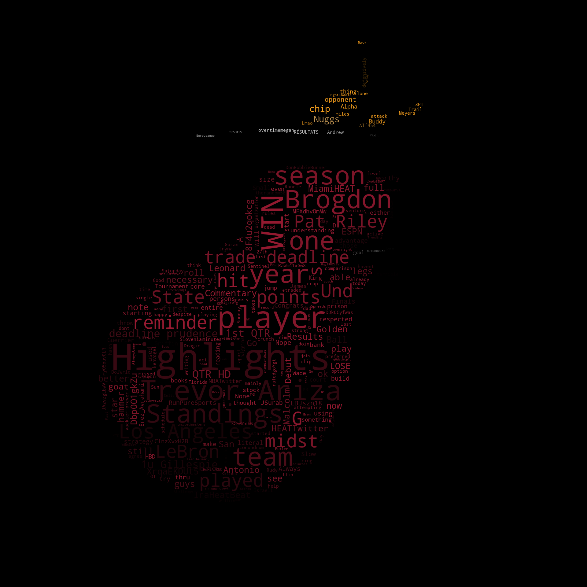

# FanStats WordCloud

The FanStats WordCloud creates a diagram of commonly used words in the context of sports leagues, teams, and players. It uses Amazon Athena to query the social media posts collected by the [FanStats Producers](https://github.com/AJ2O/fanstats-producer), and then uses the WordCloud library for Python to create the pictures. With a quick glance at a WordCloud, we can see the general social media sentiment towards a specific topic.

## Tools Used
- [AWS SDK for Python (Athena)](https://boto3.amazonaws.com/v1/documentation/api/latest/reference/services/athena.html)
- [Natural Language Toolkit](https://www.nltk.org/)
- [WordCloud for Python](https://amueller.github.io/word_cloud/index.html)
- matplotlib
- numpy
- pandas
- pillow

## Examples
There are some example WordClouds in the [examples](examples) directory, and some of them are shown below for context.

### Toronto Raptors vs. Utah Jazz (March 19, 2021)
This was a close game, with the Jazz defeating the Raptors 115-112. The free throw disparity, foul calls, and overall officiating were a hot topic from the Raptors fans' point of view.

### Milwaukee Bucks vs. Philadelphia 76ers (March 17, 2021)
The 76ers were on top of the Eastern Conference, and had won six games in a row prior to this matchup. The Bucks defeated them in overtime, snapping the 76ers' winning streak.

### Detroit Pistons vs. Houston Rockets (March 19, 2021)
The Pistons defeated the Rockets, handing the Rockets a franchise-record 19 straight losses. This fact was discussed among both sets of fans. In addition, the Rockets also traded away PJ Tucker before the NBA trade deadline.

### Miami Heat (March 19, 2021)
The Heat also made a move as the NBA trade deadline approached, adding Trevor Ariza to their roster.

